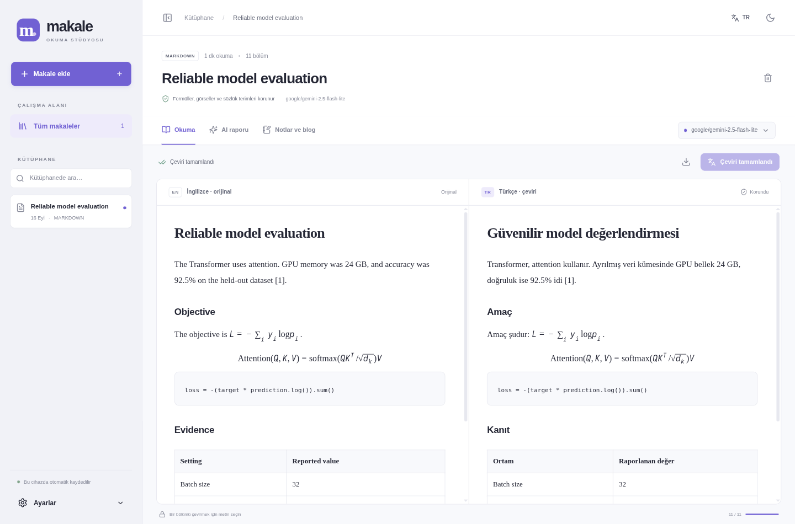

<div align="center">
  
  <h1>Makale</h1>
  <p>A quiet space to read, translate, question, and write.</p>
  <p>Linux desktop · English → Turkish · OpenRouter · Local library</p>
</div>



*Screenshots show a synthetic evaluation fixture translated with a live OpenRouter model.*

Makale is a native Linux reading studio for English research articles. Keep the English original on the left and a Turkish translation on the right, then build a detailed research review and your own notes and blog draft.

## Download

Download the **AppImage** or **Linux tar.gz** from [Releases](https://github.com/kadirnar/makale/releases).

```bash
chmod +x Makale-1.0.0.AppImage
./Makale-1.0.0.AppImage
```

If your distribution does not have FUSE, use `./Makale-1.0.0.AppImage --appimage-extract-and-run`, or extract the tarball and run `./makale`. A Linux graphical session is required. Builds are currently for **x86_64**.

## What you can do

- Import **PDF, Markdown, HTML, or plain text**, paste Markdown, or fetch a public article URL. arXiv abstract links resolve to full HTML when available, with PDF fallback for older papers.
- Read English and Turkish side by side, with synchronized passage scrolling for text documents.
- Choose from OpenRouter's live text-model catalog, search by provider or model, and inspect context size and token prices.
- Translate the whole article or selected passages. Cancel and resume without losing completed translation batches.
- Protect additional technical terms in your glossary, or select and lock passages that must remain unchanged.
- Generate a detailed, evidence-linked report after translation: contributions, architecture, equations, training, datasets, GPU hardware, compute, evaluation, strengths, weaknesses, improvements, reproducibility, and follow-up experiments.
- Write article-specific Markdown notes, generate a blog draft from your notes and report, preview it, and export it.
- Export notes, reports, and blogs as Markdown; translated articles as HTML; and an article archive as JSON (including original PDF bytes when applicable).
- Switch between **Turkish and English** UI/report languages and **light, dark, or system** themes.

## Start reading

1. Open **Settings / Ayarlar** and enter your OpenRouter API key.
2. Import an article. The sample article is an educational example, not an actual research paper.
3. Choose a model. AI actions use your OpenRouter balance and may incur provider charges.
4. Review the source. Add specialized terms to the glossary; select and lock any passage requiring exact preservation.
5. Translate. For PDFs, inspect the extracted text and acknowledge the review before translation.
6. Open **AI report** to generate the review, then **Notes & blog** to develop your own ideas.

Text selection operates on the intersecting text passages; a partially selected passage is translated or protected as a whole. Already translated passages are reused when resuming. Reports and drafts are generated on request, never published automatically.

## Preservation contract

The translator never generates the article's HTML structure. It receives plain text units; images, MathML/KaTeX formulas, code blocks, tables, and document structure remain in the source tree. Technical glossary matches, acronyms, numbers, explicit LaTeX, inline code, URLs, and citation markers are replaced with opaque placeholders. Every returned unit id and placeholder is validated before a batch is saved. Missing, duplicated, or changed protected content causes rejection. Whole placeholders may change order to accommodate Turkish grammar, but their contents are restored exactly.

Imported image files are copied byte-for-byte into local snapshots. An unavailable or unsafe image stops import rather than silently producing a missing figure. Local images must be inside the uploaded article's directory. HTML scripts, event handlers, embedded pages, forms, and unsafe styles are removed. Remote pages are not executed.

**Limits that matter:** automated terminology detection is heuristic. Add domain-specific terms to the glossary or lock their passages before translation. LLM prose still needs human review; preservation checks cannot prove semantic accuracy. PDF text extraction can lose reading order, equations, and labels, especially with multi-column or scanned documents. Makale keeps the **original PDF bytes and original rendered pages**; the Turkish pane is a text translation, not a recreated PDF layout. Review/lock extracted formula passages, or use the paper's HTML/LaTeX-bearing Markdown for more reliable structured translation. Scanned PDFs require external OCR. Images are preserved for reading; they are **not sent to the text model for visual analysis**.

Reports contain source references that jump back to the original. Missing GPU, dataset, training, and evaluation details must be labeled “not reported”; non-ML training categories may be “not applicable.” Reports are AI analysis, not externally verified facts. Reports get a second source-grounded consistency review before saving. Long articles use chunked evidence extraction and bounded hierarchical synthesis, so nuances can be missed. Always check consequential claims against the paper.

## Run from source

Use Node.js 22.12+ (Node 24 LTS recommended), npm, and a Linux desktop.

```bash
git clone https://github.com/kadirnar/makale.git
cd makale
npm ci
npm run build
npm start
```

For development, `npm run dev` starts Vite and Electron together. `npm run dist` builds an AppImage and tarball under `release/`. Node is not required for packaged builds.

## Privacy and credentials

The library is stored under Electron's application data directory, normally `~/.config/makale/`. Article data is written atomically to `workspace.json`; original PDFs are stored separately. Notes autosave locally. Library files are not encrypted. Back up this directory to preserve the whole library; the per-article JSON export is an archive format, not an in-app restore workflow.

API keys stay in Electron's main process and are encrypted with the Linux keyring when a secure backend is available. Makale refuses persistent `basic_text` fallback storage: without a keyring, the key lasts only for the session. You can also supply `OPENROUTER_API_KEY` through your process environment. No key is bundled with the application, sent to the renderer, or included in exports. Remove the key in Settings to delete the encrypted credential.

Only explicit AI actions send article text, notes, or report material to OpenRouter and the selected provider. Importing a URL contacts its host and image hosts. Public-network-only URL fetching validates redirects and socket DNS resolution. There are no analytics. Provider privacy/retention policies and billing still apply.

## Tests

```bash
npm run check        # TypeScript + production build + unit/integration + Electron UI tests
npm run test:e2e     # Desktop end-to-end tests; requires a graphical session
npm audit
```

Headless Linux CI runs Electron using `xvfb-run -a npm run test:e2e`. The test harness uses isolated temporary libraries and a deterministic fake OpenRouter provider; it does not need a real API key or spend money. The application itself has no fake-provider mode.

The suite verifies immutable math/code/image content, glossary boundaries, malformed or corrupted model responses, interruption/resume, long-article evidence, local persistence, key/API failures, PDF rendering/review, selected translation and locks, reports, notes, blog export, themes, languages, and restart persistence.

An **optional, paid** live smoke test exercises translation, reporting, blogging, the live catalog, and URL import:

```bash
# Set OPENROUTER_API_KEY securely in your environment first.
node scripts/live-smoke.mjs
# Optional: MAKALE_TEST_MODEL=provider/model
```

The live integration was verified with `google/gemini-2.5-flash-lite`. Its output is saved only in gitignored `.local/`. See [TESTING.md](TESTING.md) for the validation record.

## Implementation

- Electron, React, TypeScript, Vite; sandboxed renderer with context isolation and an allowlisted IPC bridge.
- Mozilla Readability + DOMPurify for HTML; Markdown-it + KaTeX/MathML for technical Markdown; PDF.js for original pages and text extraction.
- Custom OpenRouter client with bounded retries, timeouts, cancellation, output checks, and resumable translation batches.
- The dedicated [translation, research-review, and blog system prompts](electron/prompts.mjs) are versioned in source. The [protection engine](electron/protection.mjs) performs deterministic validation independently of the prompt.

API references: [OpenRouter chat completions](https://openrouter.ai/docs/api/api-reference/chat/send-chat-completion-request), [model catalog](https://openrouter.ai/docs/api/api-reference/models/list-all-models-and-their-properties), [Electron security](https://www.electronjs.org/docs/latest/tutorial/security), [Electron safeStorage](https://www.electronjs.org/docs/latest/api/safe-storage).

## Türkçe

Makale, İngilizce araştırma yazılarını Türkçe okuyup incelemek için geliştirilmiş bir Linux masaüstü uygulamasıdır. Solda orijinal metin, sağda çeviri bulunur. OpenRouter modeli seçebilir; makaleye ait ayrıntılı AI raporu, kendi notlarınız ve blog taslağınız üzerinde çalışabilirsiniz.

API anahtarınızı **Ayarlar** bölümünden ekleyin. Teknik terimleri sözlüğe yazın veya korunacak metni seçip kilitleyin. PDF'lerde orijinal sayfalar saklanır; çıkarılan metni ve formülleri çeviriden önce kontrol edin. Rapor, kaynakta bulunmayan GPU/eğitim/veri bilgilerini uydurmak yerine belirtilmediğini söyleyecek şekilde yönlendirilir. Notlar yerel olarak otomatik kaydedilir; blog taslakları kendiliğinden yayımlanmaz.

## License

[MIT](LICENSE). Bundled dependencies retain their respective licenses.
